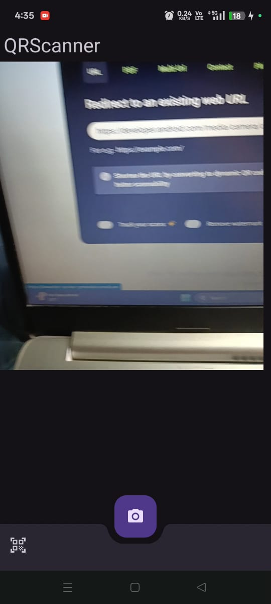
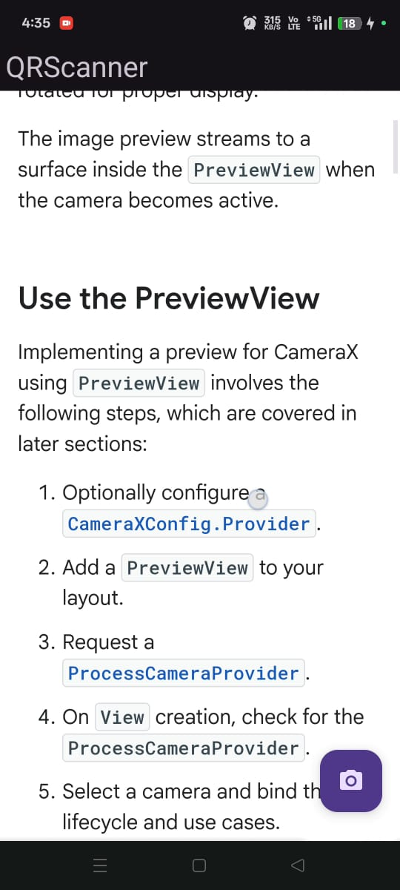

# 📷 QR Scanner App

A modern **QR Code Scanner** Android app built using **CameraX**, **Google ML Kit**, and **Dagger-Hilt**. This app features **auto-zoom** QR scanning, dynamic **BottomAppBar animations**, and in-app **WebView** previews for scanned URLs.

---

## 🚀 Features

- 🔍 **Real-time QR Scanning** using [Google ML Kit](https://developers.google.com/ml-kit/vision/barcode-scanning/android)
- 🤖 **Auto Zoom** capability with `ZoomSuggestionOptions` from ML Kit
- 📸 **CameraX API** for seamless camera preview integration
- 💉 **Dagger-Hilt** with **KSP** for dependency injection (including field injection)
- 🌐 **WebView** to display scanned URLs inside the app
- 🎯 **BottomAppBar Animation**:  
  - Hides on scroll-down  
  - FAB alignment changes dynamically (center ↔ end)
- 🧪 **Clean Architecture** (Presentation, Domain, Data layers)

---

## 🛠️ Tech Stack

- **Language**: Kotlin
- **UI**: XML, Material Design
- **Camera API**: [CameraX](https://developer.android.com/training/camerax)
- **Barcode Scanning**: [ML Kit](https://developers.google.com/ml-kit)
- **DI**: [Dagger-Hilt](https://dagger.dev/hilt/)
- **Lifecycle**: ViewModel, LiveData
- **Permissions**: Runtime camera permission handling

---

## 📸 Screenshots

| QR Preview | WebView Load |
|------------|--------------|
|  |  |

---

## ⚙️ Setup & Installation

1. **Clone this repo:**
   ```bash
   git clone https://github.com/Manash396/QRScanner.git
   
